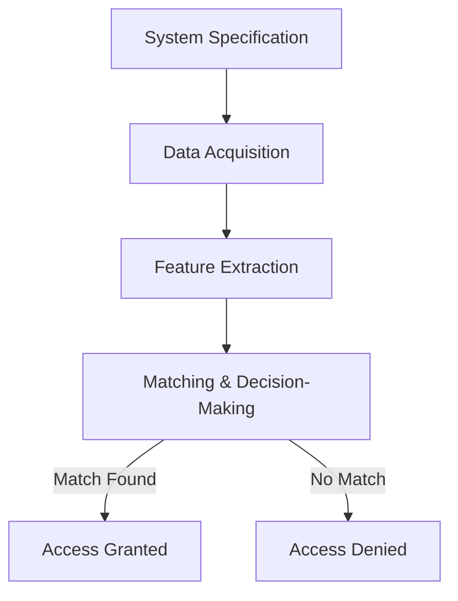

---
{"banner":"[[pixel-banner-image.png]]","dg-publish":true,"permalink":"/biometric/","dgPassFrontmatter":true}
---

*** 1 . Compare biometric authentication with traditional systems (e.g., passwords or tokens)
Using the following dimensions:
a. Security
b. Convenience
c. Scalability
d. Cost-effectiveness
O Identify one real-world example for each dimension and evaluate how biometric
Systems improve on traditional systems.***

### **Comparison of Biometric Authentication and Traditional Systems**

| **Dimension**          | **Biometric Authentication**                                                          | **Traditional Systems (Passwords/Tokens)**                                         | **Example & Evaluation**                                                                                                                                             |
| ---------------------- | ------------------------------------------------------------------------------------- | ---------------------------------------------------------------------------------- | -------------------------------------------------------------------------------------------------------------------------------------------------------------------- |
| **Security**           | Unique and difficult to forge or steal. Less vulnerable to hacking and phishing.      | Susceptible to hacking, phishing, and credential theft.                            | **Apple’s Face ID vs. Passwords** - Face ID requires a live facial scan, reducing risks associated with stolen or reused passwords.                                  |
| **Convenience**        | Faster authentication without memorization or input.                                  | Requires users to remember passwords or carry physical tokens.                     | **Airport Biometric Check-ins vs. Boarding Passes** - Automated biometric gates process passengers faster than manual document verification.                         |
| **Scalability**        | Effective for large-scale use with proper infrastructure.                             | Easier initial deployment but harder to manage due to frequent resets.             | **Aadhaar Biometric System (India) vs. ID Cards** - Aadhaar registers over a billion people biometrically, reducing identity fraud compared to traditional ID cards. |
| **Cost-effectiveness** | High setup costs but lower long-term maintenance. No need for resets or replacements. | Lower initial costs but higher expenses for password resets and security breaches. | **Banks Using Fingerprint Authentication vs. OTP Tokens** - Fingerprint-based logins cut costs related to issuing and managing physical tokens for banking security. |
*** 2. Explain the three main functionalities of biometric systems: verification, identification,
And screening.
O Provide a detailed real-world application for each.
O Discuss how accuracy and system performance differ in these functionalities.***

 ### **Three Main Functionalities of Biometric Systems**

|**Functionality**|**Description**|**Real-World Application**|**Accuracy & System Performance**|
|---|---|---|---|
|**Verification (1:1 Matching)**|Confirms a person’s identity by comparing their biometric data to a stored template. Requires the user to claim an identity (e.g., username, ID number).|**Smartphone Unlocking (Face ID, Fingerprint Unlock)** - A user’s fingerprint or facial scan is compared against their registered template to unlock the phone.|**High Accuracy & Fast Processing** - Since the system only compares one template, it is highly accurate and quick, with minimal processing power required.|
|**Identification (1:N Matching)**|Determines who a person is by comparing their biometric data against a database of multiple stored templates. No claimed identity is provided.|**Law Enforcement (Fingerprint Databases like AFIS)** - A fingerprint found at a crime scene is checked against a database to identify the suspect.|**Moderate Accuracy & High Processing Load** - Since it must search through a large database, identification takes longer and has a higher chance of false matches if not properly optimized.|
|**Screening (1:Few Matching)**|Checks whether a person is on a predefined watchlist or group of concern. Unlike full identification, it focuses on a limited subset.|**Airport Security (TSA PreCheck, No-Fly List Matching)** - Airports use facial recognition to compare passengers against security watchlists.|**Balance of Accuracy & Speed** - The system must balance security with efficiency, as false positives or negatives can impact airport operations.|

### **Accuracy & System Performance Differences**

- **Verification (1:1)** → Highest accuracy and speed since it only compares one template.
- **Identification (1:N)** → More resource-intensive with a higher risk of false matches as the database size increases.
- **Screening (1:Few)** → Requires fine-tuning to minimize false positives while ensuring security. Balances speed and accuracy better than full identification.

*** 3. Define False Acceptance Rate (FAR), False Rejection Rate (FRR), and Equal Error Rate
(EER).
O Develop a scenario where low FAR is prioritized over FRR, and another scenario
Where low FRR is critical.
O How would the design and calibration of the system change for each scenario? ***

### **Definitions**

- **False Acceptance Rate (FAR)**: The probability that an unauthorized person is incorrectly authenticated by the biometric system. A high FAR means security threats may gain access.
- **False Rejection Rate (FRR)**: The probability that a legitimate user is incorrectly denied access. A high FRR leads to user inconvenience.
- **Equal Error Rate (EER)**: The point where FAR and FRR are equal. It is often used as a benchmark to measure a biometric system’s overall accuracy—the lower the EER, the better the system.

---

### **Scenario 1: Prioritizing Low FAR (Security-Critical Environment)**

**Example: Military Facility Access Control**

- In a military base, preventing unauthorized access is critical. Even if a legitimate soldier is occasionally denied entry (higher FRR), it is acceptable compared to the risk of an intruder gaining access (low FAR).

**System Design & Calibration:**

- **Stricter Matching Threshold:** The system will require near-perfect matches, reducing the chance of false acceptance.
- **Multi-Factor Authentication:** Biometrics may be combined with ID cards or passwords for added security.
- **Higher Sensitivity in Feature Matching:** More detailed biometric data (e.g., high-resolution iris scanning) is used to ensure precision.

---

### **Scenario 2: Prioritizing Low FRR (User Convenience Environment)**

**Example: Public Transport Biometric Ticketing System**

- In a metro station using face recognition for ticket validation, a high FRR would cause long queues and frustration among daily commuters. Here, it is better to have a slightly higher FAR than inconvenience thousands of users.

**System Design & Calibration:**

- **Relaxed Matching Threshold:** The system allows minor variations in biometric scans to reduce false rejections.
- **Faster Processing Over Security:** Speed is prioritized over absolute accuracy to maintain smooth passenger flow.
- **Fallback Methods:** Users who are falsely rejected can quickly use an alternative (e.g., QR code, manual verification).

---

### **Key Takeaways for System Design**

- **Security-Focused Systems (Low FAR):** Stricter settings, multi-layer authentication, and detailed biometric analysis.
- **Convenience-Focused Systems (Low FRR):** More flexible matching criteria, faster processing, and alternative authentication methods.

*** 4. Create a flowchart illustrating the design cycle of biometric systems. Include the
Following stages:
O System specification
O Data acquisition
O Feature extraction
O Matching and decision-making***

## Explanation of Each Stage
## **1. System Specification**

**Challenges & Solutions:**

- **Challenge 1:** Choosing the right biometric modality (e.g., fingerprint, face, iris).
    - _Solution:_ Conduct feasibility studies based on security, cost, and user convenience.
- **Challenge 2:** Balancing security and user convenience.
    - _Solution:_ Define adjustable security thresholds to optimize both aspects.
- **Challenge 3:** Ensuring system scalability for large populations.
    - _Solution:_ Implement cloud-based architectures for efficient data management.

---

## **2. Data Acquisition**

**Challenges & Solutions:**

- **Challenge 1:** Poor-quality biometric data due to environmental conditions.
    - _Solution:_ Use advanced sensors and preprocessing techniques (e.g., noise reduction).
- **Challenge 2:** User non-cooperation or resistance to biometrics.
    - _Solution:_ Educate users on privacy and security benefits while offering alternative authentication methods.
- **Challenge 3:** Spoofing or presentation attacks (e.g., fake fingerprints, deepfake faces).
    - _Solution:_ Integrate liveness detection mechanisms and multi-modal biometrics.

---

## **3. Feature Extraction**

**Challenges & Solutions:**

- **Challenge 1:** Extracting discriminative features from biometric data.
    - _Solution:_ Use deep learning-based feature extraction for high accuracy.
- **Challenge 2:** Processing speed and computational cost.
    - _Solution:_ Optimize algorithms for real-time processing and leverage hardware acceleration (e.g., GPUs, TPUs).
- **Challenge 3:** Handling variations in biometric traits (e.g., aging, injuries).
    - _Solution:_ Use adaptive algorithms that update biometric templates over time.

---

## **4. Matching & Decision-Making**

**Challenges & Solutions:**

- **Challenge 1:** False Acceptance Rate (FAR) vs. False Rejection Rate (FRR) trade-off.
    - _Solution:_ Fine-tune matching thresholds based on security requirements.
- **Challenge 2:** Large database search inefficiencies in 1:N identification.
    - _Solution:_ Implement indexing techniques and AI-driven matching.
- **Challenge 3:** Privacy concerns over biometric data storage.
    - _Solution:_ Use secure storage methods like homomorphic encryption and differential privacy.

*** 5. Discuss three specific forensic applications of biometrics (e.g., latent fingerprint
Matching, facial recognition in criminal investigations).
 For each application, provide an example of a case where biometrics played a key
Role.
 Identify and explain challenges unique to forensic biometrics compared to
Commercial applications. ***

### **Forensic Applications of Biometrics**

#### **1. Latent Fingerprint Matching**

- **Overview:** Used to identify suspects by comparing partial fingerprints found at crime scenes with databases like AFIS (Automated Fingerprint Identification System).
- **Real-World Case: Madrid Train Bombings (2004)**
    - A fingerprint found on a bag of detonators was mistakenly attributed to an American lawyer, Brandon Mayfield.
    - The FBI later admitted an error, highlighting the need for more rigorous forensic fingerprint analysis.
- **Challenges vs. Commercial Applications:**
    - **Forensic Challenge:** Latent prints are often incomplete or smudged, making matches less reliable.
    - **Commercial Difference:** Consumer devices (e.g., smartphone fingerprint sensors) scan full, high-quality fingerprints.
    - **Solution:** AI-driven enhancement techniques to reconstruct partial prints.

---

#### **2. Facial Recognition in Criminal Investigations**

- **Overview:** Used to identify suspects from surveillance footage, social media, or law enforcement databases.
- **Real-World Case: Capitol Riots (2021)**
    - Law enforcement used facial recognition to identify rioters by analyzing security camera footage and social media images.
    - Multiple suspects were arrested based on matches with driver’s license and criminal record databases.
- **Challenges vs. Commercial Applications:**
    - **Forensic Challenge:** Low-quality images (blurry, poorly lit CCTV footage) reduce accuracy.
    - **Commercial Difference:** Consumer systems (e.g., Apple Face ID) work with high-resolution, controlled images.
    - **Solution:** AI-based image enhancement and multi-angle recognition for better accuracy.

---

#### **3. DNA Biometrics in Criminal Identification**

- **Overview:** DNA profiling is used for suspect identification, solving cold cases, and identifying victims.
- **Real-World Case: Golden State Killer (2018)**
    - Investigators used public genetic databases (GEDmatch) and familial DNA analysis to identify Joseph James DeAngelo, decades after his crimes.
- **Challenges vs. Commercial Applications:**
    - **Forensic Challenge:** DNA samples at crime scenes may degrade or become contaminated.
    - **Commercial Difference:** Consumer DNA testing (e.g., 23andMe) relies on high-quality samples collected under controlled conditions.
    - **Solution:** Advanced forensic DNA preservation techniques and probabilistic matching algorithms.

*** 6. Biometric systems often face security and privacy concerns. For each of the following
Scenarios, provide a solution to mitigate the risks:
 Scenario 1: A biometric database is compromised, exposing fingerprint data.
 Scenario 2: Biometric systems are used for mass surveillance, raising privacy
Concerns. ***

### **Security and Privacy Concerns in Biometric Systems**

#### **Scenario 1: A Biometric Database is Compromised, Exposing Fingerprint Data**

- **Risk:** Unlike passwords, fingerprints cannot be changed if stolen, leading to potential identity theft and unauthorized access.
- **Solution:**
    1. **Biometric Template Protection:** Use encryption and transformation techniques (e.g., fuzzy vaults, homomorphic encryption) so that stolen templates cannot be easily used.
    2. **Tokenized Biometrics:** Store biometric data in a tokenized form, where raw fingerprints are never directly stored.
    3. **Multi-Factor Authentication (MFA):** Combine biometrics with secondary authentication methods (e.g., PINs, smart cards) to reduce dependency on a single factor.
    4. **Decentralized Storage:** Implement on-device biometric storage (e.g., Apple Face ID stores data in the Secure Enclave) rather than central databases, reducing the risk of mass leaks.

---

#### **Scenario 2: Biometric Systems are Used for Mass Surveillance, Raising Privacy Concerns**

- **Risk:** Unregulated biometric surveillance can lead to privacy violations, tracking individuals without consent, and potential misuse by authorities or corporations.
- **Solution:**
    1. **Strict Legal Frameworks & Regulations:** Governments should enforce clear laws on where, when, and how biometric surveillance can be used, with oversight mechanisms in place.
    2. **User Consent & Transparency:** Organizations should disclose the use of biometric data and obtain explicit consent before collection.
    3. **Anonymization & Differential Privacy:** Implement privacy-preserving techniques such as encrypting facial recognition data and ensuring it is only used for authorized purposes.
    4. **Limited Data Retention Policies:** Ensure biometric data is deleted after a short period unless legally required to be stored.
    5. **Public Audits & Accountability:** Independent third-party audits can help monitor compliance and prevent misuse of biometric data.

By implementing these solutions, biometric systems can enhance security while ensuring ethical and legal protections for individuals.

*** 7. Case Study: Research a real-world incident where a biometric system failed or was
Hacked. Write a report covering:
O The cause of the failure.
O The impact on users and the organization.
O Steps that could have been taken to avoid the failure. ***

### **Case Study: Aadhaar Biometric Data Breach (India)**

#### **Overview**

Aadhaar, India's national biometric identification system, was designed to provide a unique identity to over 1.3 billion citizens. However, multiple security breaches have exposed sensitive biometric and personal data, raising concerns over its security and reliability.

---

### **1. Cause of the Failure**

The Aadhaar system faced multiple security breaches, including:

- **Database Vulnerabilities:** In 2018, an investigation revealed that Aadhaar data was being sold on WhatsApp groups for as little as ₹500 (approximately $7). The breach was linked to a government website that leaked access credentials, allowing unauthorized access to Aadhaar records.
- **Poor API Security:** A lack of proper authentication mechanisms allowed unauthorized parties to retrieve Aadhaar details using API calls.
- **Biometric Replay Attacks:** Attackers were able to replay stored biometric authentication data to gain unauthorized access to services.

---

### **2. Impact on Users and the Organization**

- **Loss of Privacy:** Millions of users' Aadhaar numbers, along with personal details (names, addresses, phone numbers), were leaked, leading to potential identity theft.
- **Fraud and Unauthorized Transactions:** Criminals used stolen Aadhaar credentials to fraudulently access banking and government services.
- **Damage to Government and Public Trust:** The Indian government faced criticism over its handling of data security, leading to legal challenges and public distrust in biometric authentication.

---

### **3. Steps to Avoid the Failure**

- **Enhanced Database Security:** Implement strong encryption and secure access controls to prevent unauthorized data leaks.
- **Stronger API Security:** Enforce strict authentication and authorization checks for all API endpoints to prevent unauthorized data access.
- **Liveness Detection for Biometrics:** Implement AI-driven liveness detection to prevent replay attacks by ensuring that the biometric data comes from a live user rather than a stored copy.
- **Decentralized Storage:** Store biometric data locally on user devices (e.g., smartphones) rather than a central database to minimize the risk of mass data breaches.
- **Regular Security Audits:** Conduct periodic security assessments to identify and patch vulnerabilities before they can be exploited.

---

### **Conclusion**

The Aadhaar breach highlights the risks associated with large-scale biometric systems. While biometrics offer security and convenience, robust cybersecurity measures, strict access controls, and privacy-focused policies are essential to prevent future failures.

***  8. Research: Write a proposal for an advanced biometric system that addresses at least one
Of the following challenges:
O Improving accuracy in noisy environments.
O Reducing bias in biometric algorithms.
O Securing biometric data during transmission and storage.
O Your proposal should include:
 The biometric modality (e.g., fingerprint, iris, voice).
 A novel feature or improvement.
 A detailed plan for implementing your solution.  ***

### **Proposal for an Advanced Biometric System: Secure and Bias-Free Multimodal Biometric Authentication**

#### **1. Introduction**

Biometric systems are widely used for authentication, but they face challenges such as **bias in recognition algorithms** and **security risks in data transmission and storage**. This proposal presents a **Secure and Bias-Free Multimodal Biometric Authentication System (SB-MBAS)** that integrates **iris, fingerprint, and voice recognition** with enhanced **privacy protection and bias reduction techniques**.

---

### **2. Biometric Modality**

The proposed system combines:

- **Iris Recognition** (high accuracy, less affected by age or skin tone).
- **Fingerprint Scanning** (widely adopted, fast processing).
- **Voice Recognition** (useful in hands-free scenarios).

Multimodal authentication reduces bias by allowing multiple biometric traits to contribute to decision-making.

---

### **3. Novel Feature or Improvement**

The system introduces two key innovations:

1. **Bias-Reduction Algorithm Using AI Fairness Techniques**
    
    - Uses machine learning models trained on diverse demographic datasets to **minimize racial, gender, and age-related bias**.
    - Adaptive thresholding adjusts recognition sensitivity based on environmental conditions.
2. **End-to-End Secure Biometric Encryption**
    
    - Uses **homomorphic encryption** to ensure biometric data is **encrypted even during processing**, preventing theft in transmission or storage.
    - Stores encrypted biometric templates using **decentralized blockchain-based storage**, preventing single-point failures.

---

### **4. Implementation Plan**

#### **Phase 1: Research and Development (6 Months)**

- Collect diverse biometric datasets ensuring fair representation.
- Train AI models to detect and mitigate biases in recognition.
- Develop and test homomorphic encryption for biometric data.

#### **Phase 2: Prototype Development (6 Months)**

- Build a prototype integrating iris, fingerprint, and voice recognition.
- Implement **secure edge processing**, where biometric data is processed on local devices rather than transmitted to central servers.
- Test accuracy and fairness against benchmark datasets.

#### **Phase 3: Pilot Testing (6 Months)**

- Deploy the system in a controlled environment (e.g., corporate offices, airports).
- Gather user feedback and refine the algorithm for real-world conditions.

#### **Phase 4: Full-Scale Deployment (Ongoing)**

- Implement in high-security sectors such as banking, healthcare, and border security.
- Continuously update AI fairness models and security mechanisms.

---

### **5. Expected Impact**

✅ **Improved Security:** Encrypted biometrics ensure that even if data is stolen, it remains unusable.  
✅ **Reduced Bias:** AI fairness algorithms improve recognition across different demographics.  
✅ **Scalability:** The multimodal approach makes the system adaptable for various applications.

This proposal ensures **a secure, fair, and future-ready biometric authentication system** that enhances trust and usability across industries. 🚀